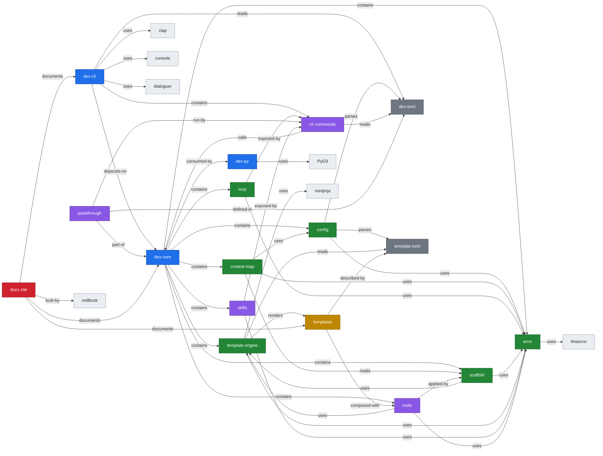

# Repo Knowledge Graph

> **Generated file — do not edit by hand.** Built from the `.context/` entity files by `scripts/gen_context_graph.py`. Edit those files and re-run the generator to update this page.

This graph captures **17 entities** across the dex codebase and how they relate. Click any node to jump to its summary.

## Entities

### dex-cli

**Kind:** crate  

The binary crate. Owns all user interaction — argument parsing, prompts, and terminal output.

`crates/dex-cli/` produces the `dex` binary — the primary distribution. It owns
**all** user interaction: argument parsing (`clap` derive), interactive prompts
(`dialoguer`), and output formatting/styling (`console`, `indicatif`).

It is a thin layer: it parses input, calls into `dex-core` for the actual work,
then renders the returned data or errors. `src/main.rs` dispatches to command
modules under `src/commands/` (init, add, agent, run, mcp, skills, templates,
passthrough). Output helpers live in `src/output.rs`.

**Related:**

- depends-on → [dex-core](#dex-core)
- contains → [cli-commands](#cli-commands)
- reads → [dex-toml](#dex-toml)
- uses → `clap` *(external)*
- uses → `dialoguer` *(external)*
- uses → `console` *(external)*

*Source: [`.context/dex-cli.md`](https://github.com/yarrib/dex/blob/main/.context/dex-cli.md)*

### dex-core

**Kind:** crate  

The Rust library holding all business logic. No UI, no terminal output — it returns data for the CLI to render.

`crates/dex-core/` is the heart of dex. Per the architectural rules it contains
**all** business logic and has **no UI**: no colors, prompts, or spinners. It
returns plain data and propagates `thiserror`-based errors with `?`; callers
(the CLI) decide how to render them.

The public API surface lives in `src/lib.rs`; implementation is split into
submodules (`config`, `template`, `scaffold`, `context_map`, `mcp`, `skills`,
`traits`, `error`). Keeping the core pure and UI-free is what makes it testable
and reusable across the CLI binary and the optional Python bindings.

**Related:**

- contains → [config](#config)
- contains → [template-engine](#template-engine)
- contains → [scaffold](#scaffold)
- contains → [context-map](#context-map)
- contains → [mcp](#mcp)
- contains → [skills](#skills)
- contains → [traits](#traits)
- contains → [error](#error)
- consumed-by → [dex-cli](#dex-cli)
- consumed-by → [dex-py](#dex-py)

*Source: [`.context/dex-core.md`](https://github.com/yarrib/dex/blob/main/.context/dex-core.md)*

### dex-py

**Kind:** crate  

Optional PyO3 bindings exposing dex-core to Python. Not required for the native binary.

`crates/dex-py/` is a thin, **optional** FFI layer that exposes `dex-core` to
Python via PyO3. It exists for backwards compatibility and Python interop, but
is not part of the primary distribution — the native `dex` binary from `dex-cli`
needs no Python runtime.

Because it wraps `dex-core`, it inherits the same business logic. Its job is
type conversion across the FFI boundary (Rust results/errors ↔ Python
objects/exceptions), not new behavior.

**Related:**

- wraps → [dex-core](#dex-core)
- uses → `PyO3` *(external)*

*Source: [`.context/dex-py.md`](https://github.com/yarrib/dex/blob/main/.context/dex-py.md)*

### config

**Kind:** module  

Parses and validates TOML configuration — project, template, and user config.

`crates/dex-core/src/config.rs` handles all TOML configuration parsing and
merging. dex is TOML-only by rule — no YAML or JSON for config.

It reads three kinds of config:

- **Project config** — `dex.toml` (tasks and pass-through commands).
- **Template manifests** — `template.toml` (variables, file rules).
- **User config** — `~/.config/dex/config.toml`.

It exposes typed structs (e.g. project config with a `tasks` map) consumed by
`scaffold`, `context-map`, and the CLI command layer.

**Related:**

- part-of → [dex-core](#dex-core)
- parses → [dex-toml](#dex-toml)
- parses → [template-manifest](#template-manifest)
- uses → [error](#error)

*Source: [`.context/config.md`](https://github.com/yarrib/dex/blob/main/.context/config.md)*

### context-map

**Kind:** module  

Emits a machine-readable .context-map.json after scaffolding, optimized for LLM consumption.

`crates/dex-core/src/context_map.rs` writes a `.context-map.json` into a freshly
scaffolded project. It is a machine-readable index optimized for AI agents: it
tells them what was created, the **role** of each file (e.g. `entry_point`,
`config`, `test`), where to start editing, and the project's tasks.

Roles come from template file-rule annotations (`context_role`,
`context_description`) when present, otherwise they are inferred from path
heuristics. Writing the map is best-effort and non-fatal.

> Note: this is the *per-generated-project* context map. It is the conceptual
> cousin of this repo's own `.context/` knowledge graph, but operates on
> scaffolded output rather than the dex codebase itself.

**Related:**

- part-of → [dex-core](#dex-core)
- reads → [scaffold](#scaffold)
- uses → [config](#config)
- uses → [error](#error)

*Source: [`.context/context-map.md`](https://github.com/yarrib/dex/blob/main/.context/context-map.md)*

### error

**Kind:** module  

The thiserror-based error type for dex-core. Errors are propagated, never panicked.

`crates/dex-core/src/error.rs` defines `DexError`, the library's error type,
built with `thiserror` (never `anyhow` in the core). Every fallible operation in
`dex-core` returns `Result<_, DexError>` and uses `?` for propagation — no
`unwrap()` or `expect()` in library code.

Variants carry context (e.g. `Io { path, source }`). The CLI layer maps these to
formatted, user-facing messages, and `dex-py` maps them to Python exceptions.

**Related:**

- part-of → [dex-core](#dex-core)
- uses → `thiserror` *(external)*

*Source: [`.context/error.md`](https://github.com/yarrib/dex/blob/main/.context/error.md)*

### mcp

**Kind:** module  

Model Context Protocol support — backs `dex mcp serve` for exposing dex to AI agents.

`crates/dex-core/src/mcp.rs` provides the Model Context Protocol functionality
that backs the `dex mcp serve` command. It lets AI agents/tools interact with
dex capabilities over MCP.

As with the rest of `dex-core`, it returns data and propagates errors; the CLI
(`commands/mcp.rs`) handles process/serving concerns and user-facing output.

**Related:**

- part-of → [dex-core](#dex-core)
- uses → [error](#error)
- exposed-by → [cli-commands](#cli-commands)

*Source: [`.context/mcp.md`](https://github.com/yarrib/dex/blob/main/.context/mcp.md)*

### scaffold

**Kind:** module  

Orchestrates turning a template into a directory tree — creates dirs and renders files.

`crates/dex-core/src/scaffold.rs` is the orchestrator behind `dex init`. Given a
loaded template and resolved variables, it creates the directory structure and
renders each file through the template engine to disk.

It returns a `ScaffoldResult` (`files_created`, `directories_created`,
`on_success`) which the CLI renders, and which `context-map` reads to emit the
project's `.context-map.json`. Related logic for applying optional capability
bundles lives in `apply_trait.rs`.

**Related:**

- part-of → [dex-core](#dex-core)
- uses → [template-engine](#template-engine)
- produces → [context-map](#context-map)
- uses → [error](#error)

*Source: [`.context/scaffold.md`](https://github.com/yarrib/dex/blob/main/.context/scaffold.md)*

### template-engine

**Kind:** module  

Renders Jinja2 templates with minijinja — engine wrapper, registry, and variable handling.

`crates/dex-core/src/template/` is the rendering subsystem. dex extensibility is
template-driven, and templates use Jinja2 syntax (`.j2` file extension), familiar
to Python users.

Submodules:

- `engine.rs` — a `minijinja::Environment` wrapper that renders strings/files.
- `registry.rs` — discovers and loads templates (built-in via `include_dir`, plus
  directory and remote git registries).
- `variables.rs` — variable specs, defaults, and validation.
- `manifest.rs` — deserializes `template.toml`.

Built-in templates are embedded at compile time. The engine produces rendered
content; `scaffold` writes it to disk.

**Related:**

- part-of → [dex-core](#dex-core)
- uses → `minijinja` *(external)*
- renders → [templates](#templates)
- reads → [template-manifest](#template-manifest)
- used-by → [scaffold](#scaffold)
- uses → [error](#error)

*Source: [`.context/template-engine.md`](https://github.com/yarrib/dex/blob/main/.context/template-engine.md)*

### cli-commands

**Kind:** concept  

The user-facing subcommands (init, add, agent, run, mcp, skills, templates, passthrough) under dex-cli.

The subcommands a user invokes, implemented in `crates/dex-cli/src/commands/`
and dispatched from `main.rs`:

- `init` — scaffold a new project from a template.
- `add` — add traits/capabilities to an existing project.
- `agent` — scaffold AI agent projects (`dex agent new`).
- `run` — run a task defined in `dex.toml`.
- `mcp` — serve dex over the Model Context Protocol.
- `skills` — list/install skill bundles.
- `templates` — list/inspect available templates.
- `passthrough` — delegate to configured external CLIs.

Each command is a thin shell: parse args, call `dex-core`, render results.

**Related:**

- part-of → [dex-cli](#dex-cli)
- calls → [dex-core](#dex-core)
- reads → [dex-toml](#dex-toml)

*Source: [`.context/cli-commands.md`](https://github.com/yarrib/dex/blob/main/.context/cli-commands.md)*

### passthrough

**Kind:** concept  

Config-driven delegation to external CLIs (databricks, az, aws, git) defined in dex.toml.

Pass-throughs let orgs extend dex without writing code: a `[passthrough]` table
in `dex.toml` maps a dex subcommand to an external CLI invocation, executed via
`std::process::Command`. This is one of the two primary extensibility mechanisms
(the other being templates).

The CLI's `commands/passthrough.rs` resolves and runs these delegations, wiring
through arguments to tools like `databricks`, `az`, `aws`, or `git`.

**Related:**

- defined-in → [dex-toml](#dex-toml)
- run-by → [cli-commands](#cli-commands)
- part-of → [dex-core](#dex-core)

*Source: [`.context/passthrough.md`](https://github.com/yarrib/dex/blob/main/.context/passthrough.md)*

### skills

**Kind:** concept  

Installable bundles of agent instructions/commands, discovered and installed by dex-core and shipped in skills/.

Skills are reusable bundles of agent guidance/commands that dex can install into
a project. The core logic lives in `crates/dex-core/src/skills/`
(`registry.rs` for discovery, `installer.rs` for installation, `manifest.rs` for
parsing), and the built-in skill bundles ship in the top-level `skills/`
directory (`agent-dev`, `databricks`, `default`).

The `dex skills` command (`crates/dex-cli/src/commands/skills.rs`) exposes
listing and installation to users. See `docs/skills-authoring.md`.

**Related:**

- part-of → [dex-core](#dex-core)
- exposed-by → [cli-commands](#cli-commands)
- uses → [error](#error)

*Source: [`.context/skills.md`](https://github.com/yarrib/dex/blob/main/.context/skills.md)*

### traits

**Kind:** concept  

Optional capability add-ons (e.g. docker, CI, notebooks) layered onto a project, defined in traits/.

Traits are composable capability bundles applied on top of a scaffolded project
— for example adding a `Dockerfile`, GitHub CI, or notebook support. Core logic
lives in `crates/dex-core/src/traits/` (`registry.rs`, `manifest.rs`) plus
`apply_trait.rs`, which renders trait files through the template engine.

The built-in traits ship in the top-level `traits/` directory: `ci-github`,
`docker`, and `notebook`, each with a `trait.toml` manifest and `files/`.

**Related:**

- part-of → [dex-core](#dex-core)
- applied-by → [scaffold](#scaffold)
- uses → [template-engine](#template-engine)
- uses → [error](#error)

*Source: [`.context/traits.md`](https://github.com/yarrib/dex/blob/main/.context/traits.md)*

### templates

**Kind:** artifact  

The built-in project templates embedded at compile time and rendered into new projects.

The top-level `templates/` directory holds the built-in project templates,
embedded into the binary at compile time via `include_dir`. Each template is a
directory of `.j2` files plus a `template.toml` manifest.

Built-in templates include `default`, `python-package`, the Databricks Asset
Bundle family (`dabs-package`, `dabs-etl`, `dabs-ml`, `dabs-dashboard`,
`dabs-genie-space`, `dabs-aiagent`), Databricks apps
(`databricks-app-react`, `databricks-app-streamlit`), and AI agent starters
(`agent-anthropic`, `agent-openai`, `agent-baml`).

Orgs can also supply their own via directory or remote git registries — no code
changes needed.

**Related:**

- rendered-by → [template-engine](#template-engine)
- described-by → [template-manifest](#template-manifest)
- composed-with → [traits](#traits)

*Source: [`.context/templates.md`](https://github.com/yarrib/dex/blob/main/.context/templates.md)*

### dex-toml

**Kind:** config  

The per-project config file. Defines tasks and pass-through commands.

`dex.toml` is the project-level configuration file dex writes into scaffolded
projects and reads on subsequent commands. It is TOML by rule.

Key tables:

- `[project]` — name and source template.
- `[tasks.*]` — named commands runnable via `dex run`.
- `[passthrough]` — subcommands delegated to external CLIs.

It is parsed by the `config` module and consumed by the CLI command layer and
`context-map` generation.

**Related:**

- parsed-by → [config](#config)
- defines → [passthrough](#passthrough)
- read-by → [cli-commands](#cli-commands)

*Source: [`.context/dex-toml.md`](https://github.com/yarrib/dex/blob/main/.context/dex-toml.md)*

### template-manifest

**Kind:** config  

Per-template manifest declaring variables, file rules, and context annotations.

`template.toml` is the manifest that accompanies each template. It declares:

- **variables** — names, defaults, prompts, and validation.
- **file rules** — how source files map to output paths, including optional
  `context_role` / `context_description` annotations that flow into the
  generated `.context-map.json`.
- **metadata** — template name, description, version, and minimum dex version.

It is deserialized by `template/manifest.rs` and drives both rendering and the
per-project context map.

**Related:**

- read-by → [template-engine](#template-engine)
- parsed-by → [config](#config)
- describes → [templates](#templates)

*Source: [`.context/template-manifest.md`](https://github.com/yarrib/dex/blob/main/.context/template-manifest.md)*

### docs-site

**Kind:** meta  

The mdBook documentation site, auto-deployed to GitHub Pages — and home of this rendered knowledge graph.

The `docs/` directory is an [mdBook](https://rust-lang.github.io/mdBook/) site.
`book.toml` configures it (`src = "docs"`) and `docs/SUMMARY.md` defines the
navigation. The `.github/workflows/docs.yml` workflow builds it and deploys to
the `gh-pages` branch via `peaceiris/actions-gh-pages` on every push to `main`.

The same pipeline regenerates `docs/changelog.md` (git-cliff) and
`docs/knowledge-graph.md` (`scripts/gen_context_graph.py`), then renders Mermaid
diagrams via the `mdbook-mermaid` preprocessor. This entity's own graph is
published here for posterity.

**Related:**

- documents → [dex-cli](#dex-cli)
- documents → [dex-core](#dex-core)
- documents → [templates](#templates)
- built-by → `mdBook` *(external)*

*Source: [`.context/docs-site.md`](https://github.com/yarrib/dex/blob/main/.context/docs-site.md)*
